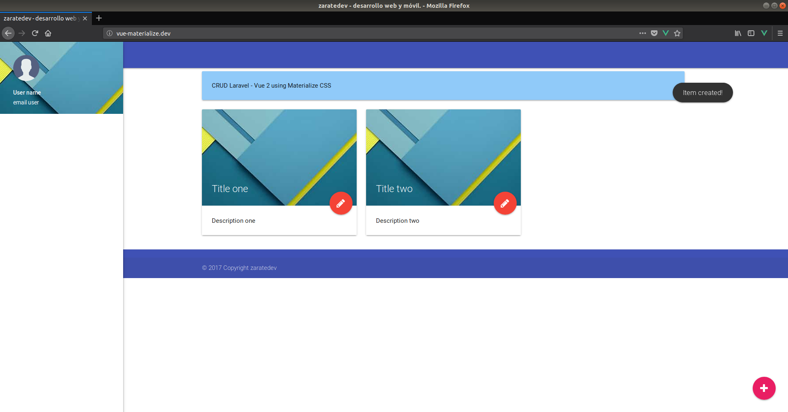

## CRUD Laravel 5.5 - Vue 2.5 Using Materialize CSS

Simple tutorial to create a CRUD using Laravel 5.5 and Vue 2.5. In this tutorial we will use Axios, Font awesome, JQuery and Materialize CSS. Implementation Webpack using LiveReloadPlugin, BrowserSyncPlugin, ImageminPlugin, CopyWebpackPlugin, imageminMozjpeg, UglifyJSPlugin. 

